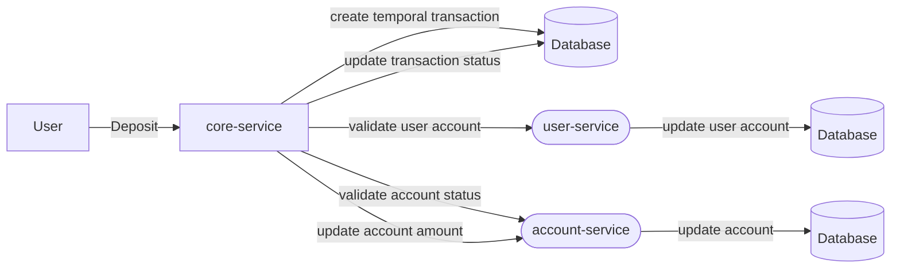

# Desafío de código Junior
Nuestro desafío te permitirá mostrarnos tus habilidades de codificación!!. También, es importante que te sientas a gusto con las tecnologías con las que debes desarrollar el desafío y no olvides que, **"tener un código correctamente estructurado y documentado habla bien de ti como desarrollador :blush:".**

***Mucha suerte!! :muscle:***

## Antes de desarrollar 
1. Para iniciar con tu desafío debes crear un **Fork** del repositorio.
2. Si ya finalizaste tu desarrollo, debes enviar un **Pull Request** con tu solución al repositorio principal.
3. Cada **commit message** que realices debe ser descriptivo y relacionado al desarrollo que has realizado.

## Problema

Cada vez que un usuario realiza un depósito en su cuenta de ahorros se genera una transacción bancaria. Esta transacción es enviada por varios procesos de validación y cumplimiento antes de ser aprobada. Además, para poder identificar cada una de las transacciones de los diferentes usuarios, se genera un identificador único de transacción.

### Procesos de validación
1. Una vez generado el identificador único de transacción se valida que el número de cuenta del usuario exista, caso contrario se lanza un error informando que la cuenta a la cual se desea realizar el depósito no existe.
2. Si la cuenta del usuario existe, se debe validar que la cuenta está activa y no está bloqueada, caso contrario se lanza un error informando que la cuenta no está activa o a su vez se encuentra bloqueada.
3. Si la cuenta del usuario está correcta, se debe registrar el nuevo valor de la cuenta del usuario e informar que la transacción se completó correctamente.

### Tipos de depósito
1. Depósito por ventanilla: ***CASH***
2. Depósito por portal Web: ***WEB***
3. Depósito por aplicación Móvil: ***APP***

### Estados de una transacción
1. Cuando una transacción es generada, el estado de la transacción es: **PENDING**
2. Si uno de los procesos de validación falla, el nuevo estado de la transacción será: **REJECTED**
3. Y si, todos los procesos de validación son correctos, el estado de la transacción será: **APPROBED**

## Reto

Se debe desarrollar una solución que permita realizar los diferentes tipos de depósitos y que cada uno de ellos sea correctamente aprobado o rechazado.

### Indicaciones
- Las clases y atributos a crear son a criterio del candidato evaluado, únicamente colocar los atributos que considere mas importantes teniendo como máximo 5 atributos por clase.
- La informacion debe ser almacenada en una base de datos ( puede utilizar la bdd que desee).
- Realizar las pruebas (unitarias, integración) que considere necesarias.
- Aplicar las practicas, patrones, estándares, etc que considere.

### Servicios requeridos
- ***core-service:*** Servicio que crea las transacciones, valida los procesos y gestiona los estados de las transacciones.
- ***user-service:*** Este servicio se encarga de almacenar toda la información referente a los usuarios y las cuentas de los usuarios pero no almacena ningún valor monetario.
- ***account-service:*** Este servicio se encargar de almacenar toda la información asociada a las cuentas de los usuarios, como su valor actual, las transacciones realizadas sobre estas cuentas y sólo almacena transacciones aprobadas.

## Tecnologías
1. NodeJS v18+
2. NestJS Framework
3. TypeORM
4. Npm - Yarn - Pnpm